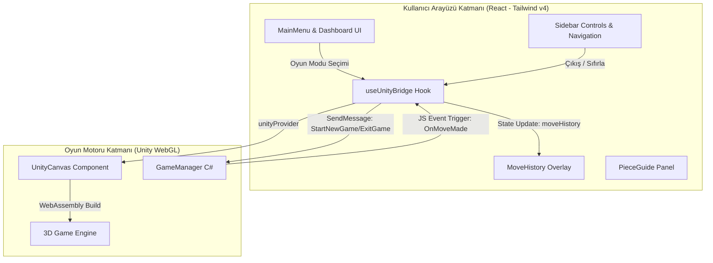

# 🏛️ Timur Satrancı: Kültürel Mirasın Dijitalleştirilmesi ve İnteraktif Eğitim Teknolojileri Entegrasyonu

> **TEKNOFEST Kültürel Mirasın Dijitalleştirilmesi & Eğitim Teknolojileri Kategorisi Projesi**  
> *Bu proje, 14. yüzyılda Büyük İmparator Emir Timur tarafından sarayında zihinsel strateji yeteneğini geliştirmek amacıyla oynatılan, ancak günümüzde unutulmaya yüz tutmuş 11x10'luk tarihi satranç varyasyonunu (Tamerlane Chess) modern 3D WebGL teknolojisiyle dijital ortama aktarır ve eğitici bir arayüzle kullanıcıya sunar.*

---

## 🎯 Projenin Amacı ve Vizyonu

Geleneksel kültürel ögelerin korunması ve gelecek nesillere aktarılması, dijital çağda yenilikçi metodolojiler gerektirmektedir. Bu projenin temel hedefleri:
1. **Kültürel Mirasın Korunması:** Emir Timur dönemine ait entelektüel bir miras olan Timur Satrancı'nın oyun kurallarını, tahta yapısını ve özgün taşlarını aslına sadık kalarak dijital ortamda yaşatmak.
2. **Pedagojik ve Bilişsel Gelişim:** Standart satranca oranla çok daha karmaşık olan bu varyasyonun (Zürafa, Deve, Fil ve Mancınık gibi 11 farklı taş çeşidi ve 110 kare) eğitim teknolojileri entegrasyonuyla bilişsel kapasite ve ileri düzey stratejik düşünme yeteneklerini desteklemek.
3. **Erişilebilirlik ve Entegrasyon:** Unity WebGL motorunun sunduğu 3D gücünü, React framework'ünün kararlı durum (state) yönetimiyle birleştirerek herhangi bir kurulum gerektirmeden tarayıcı üzerinden evrensel erişim sağlamak.

---

## 🏗️ Sistem Mimarisi ve Veri Köprüsü Şeması

Proje, yüksek performanslı oyun renderlamasını esnek ve modern bir web arayüzü ile buluşturmak için **React (Vite) / Unity WebGL Çift Katmanlı Mimari** yapısını kullanır.



### 🌉 Çift Yönlü Veri Köprüsü (Data Bridge) Çalışma Mantığı
* **React'ten Unity'ye (Command Dispatcher):** `react-unity-webgl` modülünün `sendMessage` arayüzü kullanılarak Unity içerisindeki `GameManager` nesnesine oyun parametreleri, hamle hedefleri veya ayar değişiklikleri anlık olarak iletilir.
* **Unity'den React'e (Event Listener):** Unity içindeki C# betikleri, WebGL eklentileri (plugins) vasıtasıyla JavaScript olay tetikleyicilerini (`window.dispatchReactEvent`) çalıştırır. React tarafındaki `useUnityBridge` hook'u bu olayları dinleyerek hamle geçmişi (`moveHistory`) gibi durumları anında günceller.
* **Akıllı Demo Modu Fallback'i:** Proje, derlenmiş Unity WebGL dosyalarının bulunmadığı ortamlarda dahi arayüzün test edilebilmesi için otomatik olarak simülasyon moduna geçer. Bu sayede TEKNOFEST jürisi build adımlarından bağımsız olarak tüm React arayüzünü ve veri köprüsünü deneyimleyebilir.

---

## 🛠️ Teknolojik Altyapı

* **Framework:** [React v19](https://react.dev/) (Vite tabanlı derleme ile yüksek performans ve HMR desteği)
* **Oyun Entegrasyonu:** [react-unity-webgl v10](https://github.com/jeffreylanters/react-unity-webgl) (WebGL ve WebAssembly derlemelerini sarmalayan kararlı köprü kütüphanesi)
* **Stilizasyon (CSS):** [Tailwind CSS v4](https://tailwindcss.com/)
  * *Yeni `@import "tailwindcss";` yapısı aktiftir; eski tailwind.config.js bağımlılığı kaldırılmıştır.*
  * *Tüm tasarım token'ları, renk paletleri ve animasyonlar doğrudan `src/index.css` içindeki `@theme` yönergesi ile CSS katmanında derlenir.*
* **Grafik Tasarım & UI/UX:** Özel cam efekti (glassmorphic panels) uygulamaları, Outfit & Playfair Display Google yazı tipleri ve akıcı mikro-animasyonlar.

---

## 📁 Dosya Yapısı

Temiz ve modüler bir mimari için uygulanan klasör düzeni:

```
src/
├── assets/             # Görseller, SVG ikonlar ve logolar (Örn. chessboard.png)
├── components/         # Arayüz Bileşenleri
│   ├── UnityCanvas.jsx # Unity WebGL konteyneri ve tip/loading ekranı
│   ├── Sidebar.jsx     # Sol navigasyon ve oyun içi hızlı kontroller
│   ├── MoveHistory.jsx # Oyun içi hamle geçmişi paneli (Overlay)
│   ├── PieceGuide.jsx  # Timur Satrancı özel taş ansiklopedisi (Overlay)
│   └── MainMenu.jsx    # Ana karşılama ekranı, animasyonlu sayaçlar ve giriş formu
├── hooks/              # Custom React Hooks
│   └── useUnityBridge.js # Unity-React durum yönetimi ve simülasyon mantığı
├── App.jsx             # Ana uygulama koordinatörü ve overlay katman yönetimi
├── index.css           # Tailwind v4 importları ve CSS Tasarım Token'ları
└── main.jsx            # Uygulama başlangıç noktası
```

---

## 🚀 Kurulum ve Çalıştırma Adımları

Projeyi yerel makinenizde çalıştırmak için aşağıdaki adımları takip edin:

### 1. Bağımlılıkları Yükleyin
Proje kök dizininde terminali açarak gerekli paketleri indirin:
```bash
npm install
```

### 2. Geliştirme Sunucusunu Başlatın
Yerel geliştirme sunucusunu çalıştırmak için:
```bash
npm run dev
```
Terminalde belirtilen adresi (genellikle `http://localhost:5173`) tarayıcınızda açarak projeyi inceleyebilirsiniz.

### 3. Üretim Sürümü (Build) Alın
Projeyi yayına hazırlamak ve optimize edilmiş statik dosyaları oluşturmak için:
```bash
npm run build
```
Oluşan `dist` klasörü sunucuda barındırılmaya hazırdır.

---

## 📈 Jüri Değerlendirme Notları ve Akademik Katkı

* **Yenilikçi Öğrenme:** Tarihsel bilgileri sadece metin olarak sunmak yerine, interaktif 3D oyunlaştırma ve taş kılavuzu (PieceGuide) ile birleştirerek akılda kalıcılığı artırır.
* **Modern CSS Mimarisi:** Tailwind v4 ile tamamen yapılandırma dosyalarından arındırılmış, CSS performansını maksimize eden temiz kodlama standartları uygulanmıştır.
* **Üst Düzey UI/UX:** Proje açılışında çalışan animasyonlu istatistik sayaçları, akıcı sayfa içi geçişler, hata toleranslı yükleme ekranı ve karanlık mod odaklı HSL renk uyumu jüri için yüksek görsel kalite vadetmektedir.
